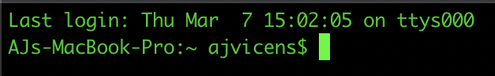
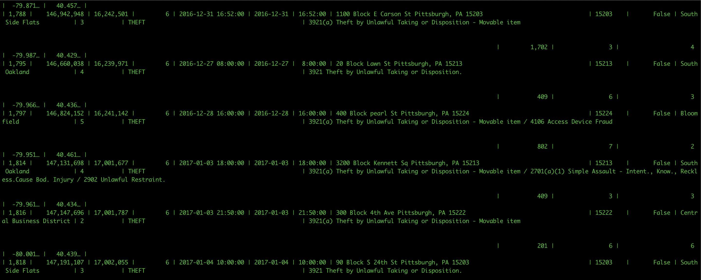
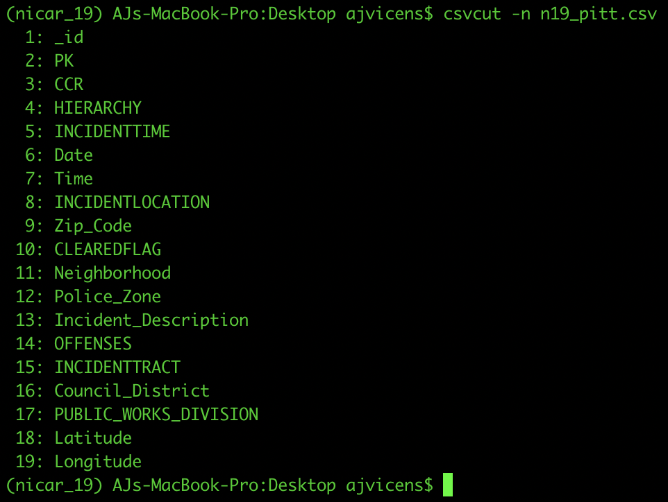
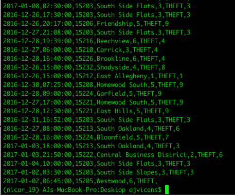
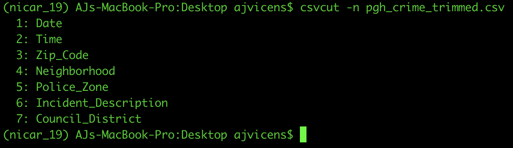
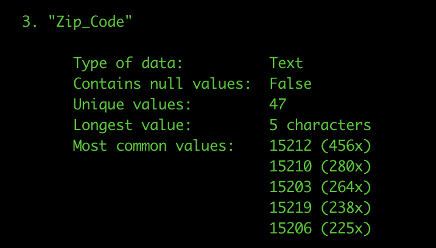
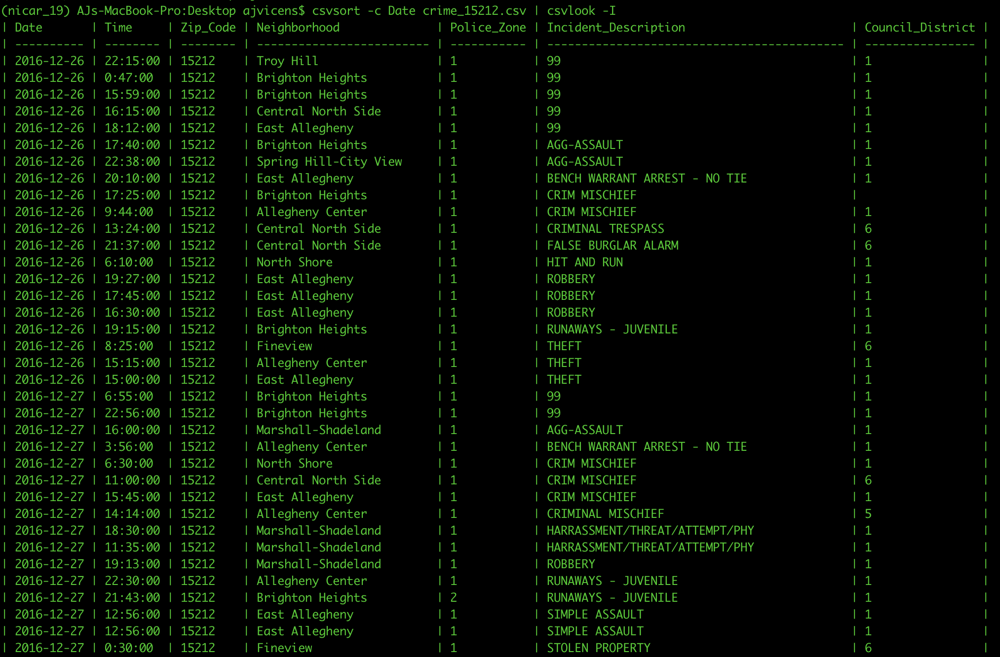
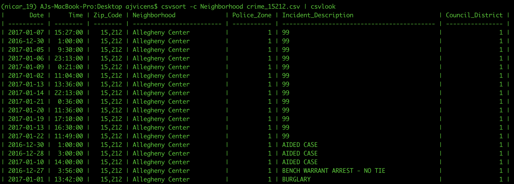
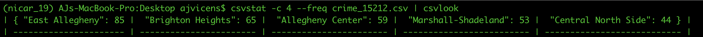
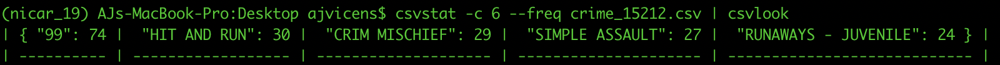

# Favorite Command Line Tools
### Command line for reporters (Mac, Linux)

Anyone can do a lot with a computer through its command line. But reporters—who spend an unnatural and likely unhealthy amount of time with their computers—there are some key commands and command line-based tools that can make life a whole lot easier. Using the command line isn't coding in the way that writing in Python or Javascript or C++ is, but mastering it is a good introduction to that world, a step toward learning and using those languages, and a way that anyone can do a whole lot more with their computer.

### First things first: What is the "command line"?

The command line is the place where you can give your computer text commands that your computer will then attempt to execute. Unlike a typical graphical user interface (GUI)—where you drag a cursor around with a mouse and click into folders and on applications to launch them—the command line takes typed commands. You might think it's more efficient to use your mouse and click around to get into folders and launch apps, but once you get the hang of simple text commands to do everything from launching programs to working with files you'll see how much more efficient the command line can be.

On your Mac, enter `command + spacebar` and type `Terminal` into the search bar. That will launch `Terminal.app`.

There are ways to customize the way your Terminal looks and many people use alternatives like [iTerm](https://www.iterm2.com/). It's up to you -- the world is your oyster!

Once you have the terminal launched you'll see the date of the last time you launched the terminal, followed on the next line by the name of your computer, the location within that computer, and the user. In this case my computer is called `AJs-MacBook-Pro`, I'm in my home directory (marked by the `~`) and my username is `ajvicens`. The dollar sign `$` is the prompt denoting that the system is ready for you to enter a command.

### Before we go any further: Why should you learn this?

You're likely asking yourself why you'd learn to use the command line. The short answer is that it's a rather powerful way to easily do all sorts of things with your computer. There are a whole host of free command-line tools relevant to the type of work we do, so long as you know a few basic commands. Once you level up slightly, you can write scripts to automate repetitive tasks. More theoretically, it's just a way to get direct access to you computer without the the graphics that we're all used to. You can go anywhere in the computer quickly. You modify files, open them, delete them, read them. You can connect to the internet, and you can see everything that's running (and kill programs, if need be).

But for our purposes, it's a very easy way to access a suite of tools to make your job easier and more efficient. For example, if you want to download a bunch of video, there's a [tool](https://ytdl-org.github.io/youtube-dl/) for that. Want to scrape Instagram? [Here](https://instaloader.github.io/) you go. And this is truly just scraping the surface.

### Some basic navigation tips and quick commands
#### `man`, `pwd`, `cd`, `ls`, `cp`, `mv`, `cat`, `ctrl + a`, `ctrl + e`, `|`, `>`, `>>`, `clear`, *tab complete*
Now that you have your Terminal app running, let's get the hang of some of the more basic commands and concepts:

`man`: Every one of the terminal's 1,400-plus commands has it's own manual page. Call it up with `man [command]`. So you could type `man man` if you wanted the manual for how that works, for instance. In some cases the manual spans more than one page and you can use the space bar to scroll. Hit `q` to get out.

`pwd`: This command tells the computer to `print working directory`, which is another way of saying "tell me where I am in my computer system." You'll use this a lot to figure out where you are, especially when you start moving around with...

`cd`: ...this command, which means `change directory`. This command can move you from one directory to another. If I was in `Users/avicens` and I wanted to get to my `Desktop`, I'd type `cd Desktop`. If I want to move up one level, I'd type `cd ..`, and if I wanted to move two levels up, I'd type `cd ../..`. By default, a Unix system will start you in your `home` directory (represented typically by a `~`).

`ls`: This command will list all* of the files and directories in a directory. So if you type `pwd` to figure out where you are, you can use `ls` to see what files and directories are in your current working directory. This command has a whole host of options, so type `man ls` to get the full scope.

*There are some files known as "hidden files" -- files that typically start with a `.` that are [used](https://en.wikipedia.org/wiki/Hidden_file_and_hidden_directory) to store user preferences or perform other functions -- that won't show up with a basic `ls` command. To see those files, type `ls -a`.*

`cp` `original_file` `new_file`: This command will copy a file. It's a good idea to use a distinct name for the file's copy, because if it a file already exists with that name, the file you're creating will overwrite that file.

`mv`: This command will move a file from one location to another. It is also used to rename a file within the same directory. Again, pick a distinct name for your new file so you don't inadvertently overwrite an existing file. You can also use `mv -i` to force your system to ask for permission before overwriting an existing file.

`cat`: This command will display the contents of a file to your terminal window. It can also be used to append the contents of one file to another using `>>`: `cat file1.txt >> file2.txt`.

`ctrl + a`: Go to the start of a line.

`ctrl + e`: Go to the end of a line.

`|`: This vertical line -- known as a "pipe" and found on the same key as the backslash -- will send the output of one command into another. This will become very useful.

`>`: Redirect the output of a command to a file. Say I wanted to make a list of everything on my Desktop. I would simply navigate to my Desktop,* and type `ls > desktop.txt`. Of course, this can get much more complex and help you perform complicated tasks, but this is the basic concept.

*You don't have to be in a given directory to do things involving that directory. Once you understand how the directories are nested, you can access them from anywhere by typing the [relative or absolute path](http://docstore.mik.ua/orelly/unix/upt/ch14_02.htm) to that directory.*

`>>`: Append one file to another (see the `cat` example above).

`clear`: Once you start cruising around, your terminal window will fill up rather quick. Use `clear` to clear it all away. Don't worry though, your stuff isn't gone. Scroll up and it's all right there.

*tab complete*: After you begin typing any file name or command, you can hit `tab` to autocomplete the name of said file or command up until the end of uniqueness. That will come in handy when you want to cat a file named `ohMyGodThisIsALongFileName.txt`.

`ctrl-C`: If at any point things hang up, using `ctrl-C` will quit whatever you're doing and exit whatever command the computer is trying to execute.

#### Here are some commands I use all the time

The great thing about using the command line is that there are a whole host of quick commands at your fingertips that can save you time. Here are some commands I find myself using frequently:

`cal`: For some reason I find myself often having to check what day of the week a particular date was. Luckily `cal` can do that for you. If you enter it without any options it'll display the current month. But it can also display months or full years worth of dates when you enter `cal [month (number)] [year (number)]`. So what day of the week was Mozart born if his birthday is January 27, 1756? Enter `cal 1 1756` and get your answer (it was a Tuesday). If we wanted that full year's calendar, we'd enter `cal 1756`. Take a look at [September of 1752](http://unix.stackexchange.com/questions/17903/is-cal-broken-what-happened-in-september-1752) for a laugh.

`whois`: Many of us know how to look up the owner of a given website domain using the [Whois](https://www.whois.net/) service. Luckily for us that command is built in to the command line. Enter `whois [domain]` (without the https:// or www). You won't always get all the information you're after, but in many cases you'll get some good information. And, using the `>` command from above you can send results to a file. So that'd be `whois [website domain] > [filename].txt`.

`wc`: This is a handy little tool for counting words in a document, or lines (rows in a csv), the number of bytes, and more. Without any flags `wc` will give you three numbers: the number of lines, the number of words, and the number of bytes. With text files (especially story drafts) I usually want to know the number of words, so I use `wc -w`. When I'm working with CSV files, you may want to check the number of rows. In that case, use `wc -l`.

`grep`: This is an [incredibly powerful](https://www.eriwen.com/tools/grep-is-a-beautiful-tool/) search tool -- technically "global regular expression print" -- that allows searching for patterns and specifics across many files or directories at once. Take it for a spin and get used to it.

`ping`: While professionals use this command for a [variety](https://www.tutorialspoint.com/unix_commands/ping.htm) of tasks, I use it to see if websites are up. It's very simple to use: `$ ping <website or IP address>`. Let it run for a few seconds and then enter `control-c` so it stops, and you can see that your traffic (referred to as "packets") is getting through.

#### Just a few useful command line tools

The beautiful thing about the command line is the plethora of tools out there that can make your life much easier. ***These require installation***, but typically that's not that hard. Here are a few I use all the time:

`youtube-dl`: This handy little guy will allow you to rip videos from YouTube and a whole host of other streaming sites. [Go check them out](https://rg3.github.io/youtube-dl/).

`ffmpeg`: There's another tool out there called `ffmpeg` that can work wonders with audio and video (streaming or at rest). I've only just scratched the surface with it and it's already streamlined my workflow. [Try it](https://ffmpeg.org/).

`csvkit`: This is an amazing Python-based tool to help you work with CSV files on the command line. Written by [Chris Groskopf](https://twitter.com/onyxfish), CSVKit is a great way to get a handle on the data you have in a given spreadsheet, clean it up a bit, and get your story jump-started. I use this all the time and recommend it so highly that I think we'll run through a quick tutorial. Keep in mind that Chris writes extensive documentation for all of his tools, so please do head over to the [tutorial he's written](https://csvkit.readthedocs.io/en/1.0.1/). I'll provide an incredibly abridged version below.

`dkimpy`: At NICAR 2019 I learned of a neat command line tool called `dkimpy` that allows a user to verify the authenticity of emails with one command ([read more here](https://www.propublica.org/nerds/authenticating-email-using-dkim-and-arc-or-how-we-analyzed-the-kasowitz-emails) via ProPublica's Jeremy B. Merrill).

`Instaloader`: This tool allows for bulk downloading of Instagram content and metadata. It's very neat and handy. Go [take a look](https://instaloader.github.io/).

#### Let's quickly run through creating directories and files (and then removing them)

Hopefully you're starting to understand that the modest little Terminal app that comes on every Mac can do a lot of very useful things (and we haven't even scratched the surface). Now, let's quickly run through creating directories, files within the directories, and then removing them (while mixing in a couple of the commands from above).

Start with navigating to your Desktop: `cd ~/Desktop`

Now, let's create a directory to work in with the `mkdir` command. The way this works is you enter the command and then name the directory. So let's just go with `mkdir QuickTest`.

Now `cd Qui[tab complete]` (you should notice that the Terminal will fill in the rest of the name). Enter `ls`. What do you see? It should be nothing.

Now, let's create a file with the `touch` command. So, enter `touch testFile.txt`. If you did it right, you'll hit enter and then nothing will happen. That's good!

Now, enter `ls`. What do you see? `testFile.txt` should be sitting there. Good work. Now let's put some words into the file. Enter `open tes[tab complete]`. A blank TextEdit file should open. Enter some text, save, and close the file.

Now, type cat tes[tab complete]. What do you get? You should see whatever text you just saved into that file printed out to your Terminal. Let's see how many words are in the file. Type `wc -w` `tes[tab complete]`. The `-w` portion of that command is what's called a flag, which customizes the way the command processes the file. In this case we're telling it to give us just the word count. Pretty neat! 

But, you know what? Maybe you want to scrap that file. Let's go ahead and remove it with the `rm` command. So enter `rm te[tab complete]`. Now enter `ls`. Should be empty. Nice work.

Let's get out of our `QuickTest` directory with `cd ..`. Now let's remove that folder with the `rmdir` command. So enter `rmdir Qui[tab complete].`

That was just a quick example to show how we can create directories, files, files within directories, and then remove them.

#### Let's jump in to CSVKit.
For my quick tutorial we'll be using crime data from the city of Pittsburgh. The file we'll start with is called [n19_pitt.csv](https://github.com/AJVicens/command-line-for-reporters/blob/master/n19_pitt.csv). To get the raw data, click on the file name in the main repo, click `Raw` to get the raw data, and then save-as with whatever file name you want in the `.csv` format.

The data set includes various codes used by the city, location data, crime codes, and other information that could come in handy depending on what you're trying to do. You could always open Excel to peek at your data:

Let's compare that to a quick peek from CSVKit. Type `csvlook n19[tab complete]`.

Ack. Not so good. Let's clean that up a bit by piping the output of that command into a `less -S` command, which allows us to look at the data one page at a time. With `-S` we cut the lines off at the width of our terminal window, so we can organize things a bit. So you're going to type in `csvlook n19[tab complete] | less -S`. You can see the left and right arrows to see the full rows. Hit `q` to get out of that view.

OK, now we're getting somewhere. We can cleanly see what we're working with, but scrolling back and forth is a bit annoying. Let's pare this down a bit. How about we start by listing out the columns. Enter `csvcut -n n19[tab complete]`.

For our purposes, we probably don't need all 19 of these columns. Let's just ride with `Date`, `Time`, `Zip_Code`, `Neighborhood`, `Police_Zone`, `Incident_Description`, `Council_District`. Luckily CSVKit makes this very simple with the `csvcut` command using either the column numbers or the column names. Let's go with column numbers for now. So enter `csvcut -c 6,7,9,11,12,13,16 n19[tab complete]`.

Notice what happens? Your computer is doing exactly what you're telling it to do: Cutting those columns from the original data set and printing them to the terminal window.

We'd probably prefer those new columns are available to us in a new sheet. Using the `>` redirection command from above, let's take the previous command and use it to create a new CSV. Enter `csvcut -c 6,7,9,11,12,13,16 n19_pitt.csv > pgh_crime_trimmed.csv`. If you enter the command and nothing happens, that's good! Now try `csvcut -n` on our new CSV, `pgh[tab complete]`.

Ah ha! Now we're down to seven columns. That's a bit more manageable. Let's run some basic stats on these columns with the `csvstat` command. So, `csvstat pgh[tab complete].` This command quickly summarizes the data in our columns, giving us a quick overview of what we're working with. The `Date` and `Time` stats are all pretty similar, so that's not all that interesting in and of itself. But take a look at the `Zip_Code` data.

What's going on in 15212? The rest of the top five zips are roughly similar, but that one is significantly higher.  There are also noticeable leaders in `Neighborhood` (South Side Flats), `Police_Zone` (3), and perhaps the `Council_District` as well.

Interesting. Obviously you're not going to write a story relying only on this super quick analysis. But within a few minutes we already have a decent idea of what we're working with and potential angles for further research and reporting. We can apply the same idea on a more granular level.

Let's focus on the 15212 zip code, which includes major attractions like PNC Park and Heinz Field, but also a series of neighborhoods undergoing gentrification and a host of other issues. Run `csvgrep -c Zip_Code -m 15212 pgh_crime_trimmed.csv | csvlook -I`. Again, it's nice to be able to see your data on the screen, but we probably want that in its own CSV. So using the `>` redirection command, let's create a new file called `crime_15212.csv`. So that's `csvgrep -c Zip_Code -m 15212 pgh_crime_trimmed.csv > crime_15212.csv`.

Let's organize this a bit using `csvsort`. Type in `csvsort -c Date crime_15212.csv | csvlook -I`. This will let us quickly sort through our list sorted on the `Date` column.

You could sort on any column you'd like this way. Try `csvsort -c Neighborhood crime[tab complete] | csvlook`.

Let's get the top five list of the neighborhoods that show up in our list. Run `csvstat -c 4 --freq crime[tab complete] | csvlook`.

Already we see that for this period of time, East Allegheny had 20 more incidents than the next highest neighborhood, Brighton Heights. A thread to follow for sure.

How about we run the same query on the `Incident_Description` column to get a handle on the type of crimes going down. Run `csvstat -c 6 --freq crime_15212.csv | csvlook`.

The `99` code refers to miscellaneous crime, so it's hard to know what to make of that. But we see that `HIT AND RUN` makes the top of the list. Why does that category lead the list in the 15212 zip code?

Again, this data needs to be vetted, checked against your sources, and treated with a grain of salt. But, *in just a matter of minutes* you have a decent grasp on threads your data is starting to reveal, and you have some things you can begin to look into.

This was a *very* basic runthrough of what CSVKit can do. I would highly recommend running through [the full CSVKit tutorial and associated documentation](https://csvkit.readthedocs.io/en/1.0.3/index.html) which will introduce you to more powerful tools available, including merging datasets, running SQL queries, and getting your data into a web-ready format.

# Resources
It's really not that hard to pick up some command line skills. Just like anything else, if you mess around with it and use it when you can you'll start to get the hang of it. Here are several handy places to learn:

* [Codeacademy](https://www.codecademy.com/learn/learn-the-command-line)  
* [Learn Command Line the Hard Way](https://learncodethehardway.org/unix/)  
* Noah Veltman's [Command Line Murders](https://github.com/veltman/clmystery)
* [O'Reilly's "Linux Pocket Guide"](http://shop.oreilly.com/product/0636920023029.do?green=B78D23C2-6E87-58C8-BAE1-0090A206787F&intcmp=af-mybuy-0636920023029.IP)
* Take a spin through some of the past NICAR command line instructions, including those put together by [Chris Keller, Jue Yang (and me)](https://github.com/chrislkeller/nicar15-command-line-basics), and another by [Kendall Taggart and Agustin Armendariz](https://github.com/armendariz/terminal_recipes).
* [Hacknet](http://hacknet-os.com/), a fun little hacking video game that's entirely played within a simulated terminal window.  

* Google: Don't underestimate the power of Google or any other search engine. You may feel like you're the only one having issues, but you're not. Many before you have done the same exact thing, and a lot of those people have either written about it or created tutorial videos.
